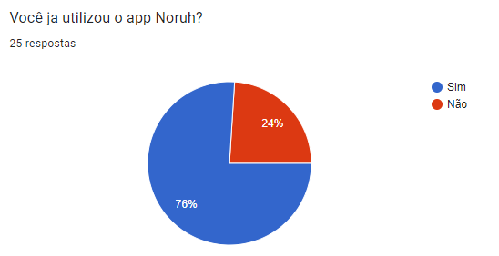
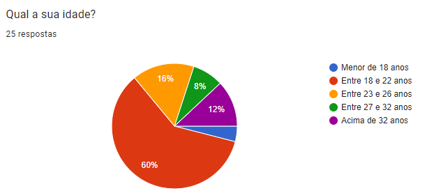
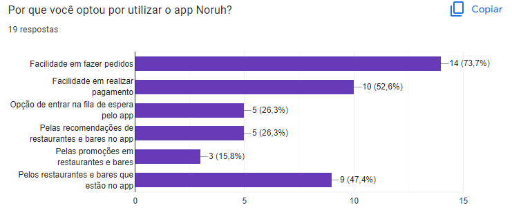
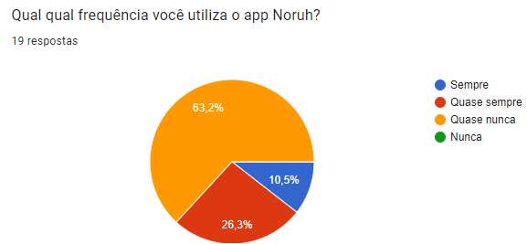
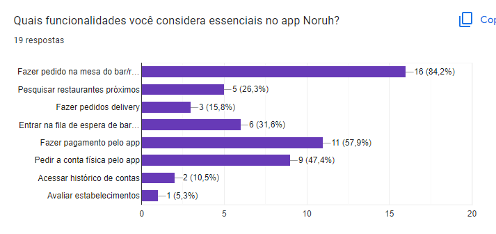
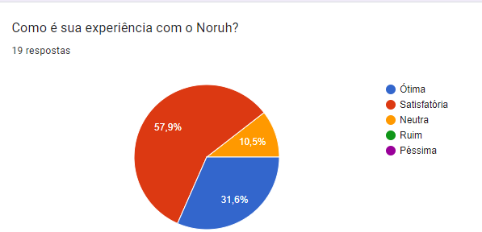
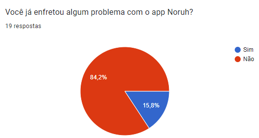
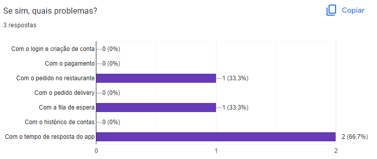

# Questionário

## 1. Introdução
&emsp;&emsp; Para a técnica de elicitação de questionário, utilizamos o google forms e fizemos um questionário com algumas perguntas sobre o aplicativo para as pessoas questionadas sobre o assunto, que enviamos via whatsapp pedindo as respostas de quem pudesse nos ajudar nessa pesquisa.

## 2. Metodologia
&emsp;&emsp; Utilizamos o questionário feito pelo Google Forms, e os enviamos para as pessoas através do whatsapp, e esperamos por dois dias para fazer a análise, e conseguimos 25 respostas, talvez pelo aplicativo não ser muito conhecido.

## 3. Questões

### Questão 1

&emsp;&emsp; Para iniciarmos o questionário, perguntamos ao usuário se ele já havia usado alguma vez o app Noruh. Para que dessa forma, pudessemos filtrar as repostas de usuários que nunca tiveram contato com app, direcionando-os ao fim do questionário após coletarmos sua idade.

### Questão 2

&emsp;&emsp; Na segunda pergunta tinhamos como objetivo saber qual a idade dos usuários. E com ela, pudemos confirmar que o app é mais popular entre jovens de 18 a 22 anos.

### Questão 3

&emsp;&emsp; Com a terceira questão, filtramos requisitos de grande importância para os usuários, que fizeram com que eles usassem o app. Dessa maneira, concluímos que a facilidade em fazer pedidos e realizar pagamentos se destacaram entre os clientes. 
### Questão 4

&emsp;&emsp; Nessa quarta questão, buscamos descobrir a frequência que os usuários utilizam o Noruh, e descobrimos que a maioria quase nunca usa
### Questão 5

&emsp;&emsp; Com a quinta questão, buscamos encontrar o grau de importância de algumas das funcionalidades para os usuários do app. Com isso, as funcionalidades de fazer o pedido na mesa, fazer pagamento pelo app e pedir a conta física pelo app se mostraram como as mais importantes nas visões dos usuários
### Questão 6

&emsp;&emsp;Nessa sexta questão buscamos descobrir qual o grau de experiência do usuário com o aplicativo, e descobrimos que a maioria diz que é satisfatória.

### Questão 7

&emsp;&emsp; Nessa sétima questão tinhamos o objetivo de descobrir se o usuário já teve algum problema com o aplicativo, e a maioria diz que não.
### Questão 8

&emsp;&emsp; Nessa oitava questão, buscamos que o usuário nos informe qual foi o problema que ele teve com o aplicativo, e descobrimos que o mais informado foi o tempo de resposta do aplicativo.

### Questão 9

&emsp;&emsp; Por fim decidimos analisar o grau de satisfação do usuário com a interface gráfica do aplicativo.

## 4. Resultado
&emsp;&emsp; Com a análise desse questionário, podemos ver que as pessoas entrevistadas tiveram um alto grau de satisfação com o app, com poucos problemas, porém podemos analisar também, que o aplicativo não é muito conhecido pelas pessoas, pelo baixo número de resultados, e que ele tem potencial para alcançar muitas pessoas pelas suas funcionalidades.

##  Histórico de Versão

| Versão |                Alteração               | Responsável |         Revisor        |  Data |
|:------:|:--------------------------------------:|:-----------:|:----------------------:|:-----:|
|   1.0  |                    -                   |    João Henrique, Lucas  | Todos | 11/07 |

## Referências 
- BARBOSA, Simone; SILVA, Bruno. Interação Humano Computador. Rio de Janeiro. Elsevier Editora Ltda. 2010